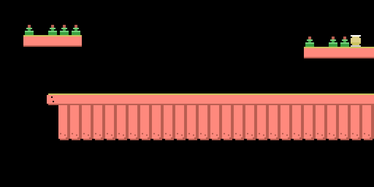

# Dead bytes

A disassembly isn't finished when the code makes sense: it's finished when every byte on the tape has an owner. In Colt 36 the accounting closes at 100% —34,239 bytes of content, 34,239 explained— but part of that content never reaches the screen. Two things are worth keeping apart, because they are easy to confuse: some bytes are **read by nothing at all**, not one instruction, and some **are read and copied but never seen**. The leftovers of the maps are the second kind, and exactly why is explained below. Counting only the pieces listed here gives **3263 dead bytes**; add the 2048 of the work area and the odd scrap of padding and it comes to **5456 bytes out of 34,239, almost 16% of the tape**.

## The 297 bytes of the variable area

The game is a tokenised MSX-BASIC program (saved already chopped into internal codes, not as text), and the block that carries it reserves 297 bytes behind the listing, at 0x8F5F–0x9087: the **variable area**, the table where the interpreter notes down the variables the program creates as it runs. Saving it to tape achieves nothing, and that can be shown here three independent ways.

The first: the program never mentions a single address in that range. The second: what was saved is destroyed the moment the game creates its first variable. The third says the most. The content is 1 dead byte, **11 bytes of a leftover variable** —a double-precision `I` holding 37025, in the exact format of the interpreter's table, reproduced byte for byte in the emulator— and **285 bytes of uninitialised RAM**. Those 285 follow the rule "0xFF if bit 0 of the address matches its bit 7, 0x00 if it doesn't", which is the documented power-on content for several machines: **282 of the 285** obey it.

And since the rule depends on the *absolute* address, the pattern works as a fingerprint. It fits 282 of the 285 (98.9%) if the block sat at 0x8000, and only 226 (79.3%) had it sat at 0x83E8, which is where the tape loads it. In other words: on the programmer's machine the game already lived at 0x8000, and 0x83E8 is a detour to keep clear of the loader. Rubbish that tells you where the game was made.

## The 88 in the loading screen


The block holding the loading illustration divides into 6144 bytes of pattern + 768 of colour + **88 bytes nobody reads** + 95 of code + 5 zeros. The 88 obey the same freshly-powered-RAM rule, 88 out of 88: the `BSAVE` that recorded the block took a range slightly wider than the data. Confirmed in the emulator too, with a watchpoint on those addresses: zero reads while the picture is drawn.

## The scenery at 0xD400 that nothing points to

At 0xD400–0xD5FF there are 512 bytes in board format: tile numbers, 32 per row. The first twelve rows draw a coherent scene —two platforms with bottles and a long stockade— out of only eight distinct patterns and **eight tiles of the sort that break when shot** (patterns 72 and 73). The last four rows, 128 bytes, are zeros.

Nobody reads it. Nowhere in the listing is there a single constant between 0xD400 and 0xD5FF, and the neighbouring copies stop just short: the title screen is 768 bytes from 0xD000 (ending at 0xD300), the scoreboard 256 from 0xD300 (ending **exactly** at 0xD400), and the next thing anything touches is already at 0xD600. A discarded piece of scenery left inside the file.



This picture has never existed on a screen. It is drawn from those 512 bytes
using the game's own tile table, which is what makes it more than a curiosity:
if the block's layout were wrong, what came out would be noise. Instead you get
an assembled scene, bottles standing on their shelves and the stockade lined up.
Somebody drew it and then decided not to use it.


## The forgotten offcut at 0xD9A0

The bandits' hiding places live at 0xD900: ten per level, four bytes each, forty bytes per level, 160 in all. The program indexes them with `K%=INT(RND(-TIME)*10)*4+&HD900+40*(N%-1)`, so the highest address it ever reads is 0xD99F.

The next 64 bytes, 0xD9A0–0xD9DF, are a **literal copy of the shapes and colours of tiles 170 to 173**: checked byte for byte against the pattern table at 0xC000 and the colour table at 0xC800. It's the 2×2 block immediately before the first bandit model, which starts at tile 174. An offcut of the big tables, pasted there and forgotten.

## The padding row at 0xD620

At 0xD600 there are 512 bytes, every one of them pattern 255, the empty tile. Line 30 uses them to clear the play area before announcing the level: `HL=&HD600 : BC=32 : FOR DE=6144 TO 6656 STEP 32`. It copies **32 bytes**, always the same ones, to seventeen consecutive rows of the screen; the source never moves. The **480 bytes from 0xD620 to 0xD7FF** are more of the same, and nobody reads them.

## The 256 zeros at 0xE200

The level's work area occupies 0xDA00–0xE1FF, and behind it come 256 zero bytes, until the first machine-code routine starts at 0xE300. They're padding, so that the routine lands on a round address. That they're never seen follows from the scroll limit in line 610: for levels 3 and 4 the limit is 0xE000 and the 512-byte window ends at 0xE1FF, the last byte of the work area. Not one byte further.

## What hasn't been identified

Here it's a matter of saying exactly what is known and what isn't.

**The leftovers of maps 1 and 2 (1536 bytes).** These are not bytes nothing touches: they **are read, and they are copied**. Each piece of scenery is a 32×64 board, 2048 bytes, and line 33 takes the whole lot to the work area in one go, with `HL=&HA000+2048*(N%-1) : DE=&HDA00 : BC=2048` and a `USR2`, which is a bare `LDIR`. So the 1024 bytes at 0xA400–0xA7FF travel along with the rest and end up at **0xDE00–0xE1FF**. But that same line 610 puts the limit at 0xDC00 for level 1 and at 0xDE00 for level 2, so the last visible window ends at 0xDDFF and at 0xDFFF: **32 rows and 48 rows**. What falls outside is, to the byte, **0xA400–0xA7FF (1024 B)** and **0xAE00–0xAFFF (512 B)**. And there they stay: the visible window ends at 0xDDFF, **a single byte before** they begin. They get copied, they take up memory for the whole game, and they are never seen.

It is worth understanding why that copy exists at all, because it isn't merely "fetching the map". The work area is a **board the game modifies as you play**: the bandits aren't sprites, they are drawn into it with `POKE`. Line 700 sets the bandit's four cells (`POKEBA%,C%` and the next three) and line 720 clears them with zeros, `BA%` always pointing inside 0xDA00.

And one of them never gets cleared: line 740, the bandit that fires, draws it and then falls through to 745, 747 and 749, which returns to the loop. None of them undoes the `POKE`. So **every bandit that gets a shot off stays painted on the board for good**. That is why the clean map has to be restored at the start of each level: without that copy, the ones that fired would pile up and keep reappearing as the screen scrolls.


What they are, no. They've been ruled out as map, as colour, as music and as a copy of any other part of the tape. Ruled out as **PCM** (digitised sound, one sample per byte): the correlation between neighbouring bytes comes out at **−0.27**, and a genuinely sampled signal gives **+0.99**. Ruled out as a **table of note periods**: read as 16-bit words, the deviation from equal temperament is **0.244 semitones**, which is what chance gives, while the game's real period table gives **0.090**.

Nor are they **a table of bandit hiding places**, which is the most natural suspicion given where they sit. The check is convenient here because the game carries a real one to compare against: the table at 0xD900, four bytes per hiding place — row, column, model and delay. Requiring all four fields to be possible at once (row below 64, column below 32, model 1 to 4, delay between 188 and 207), the genuine table gives **40 valid entries out of 40**. The suspects, read with that same format and trying all four possible alignments, give **0 out of 384**. Not one.

Two of the exclusions deserve a measurement of their own, because they close off whole families of hypotheses at once.

**They are not code, from any machine.** There is no need to go CPU by CPU: it is enough to count how many distinct byte values they use. The 1566 use **60**. Three hundred bytes of Z80 code from this same tape use **67**, and a program needs far more as it grows, because it has to name registers, jumps and constants. The consequence is that instructions no program can do without are missing: in the 1566 bytes there are **zero `CALL` (0xCD), zero `RET` (0xC9), zero 0xED prefixes, zero `JR`, zero `DJNZ` and zero `LD BC,nn`**. Not one. And since this is a count over the set of bytes, it holds for any alignment and any eight-bit processor: if the opcode isn't in the block, it isn't in any reading of the block.

**They are not a picture, at any width.** And here a measurement that looked conclusive turns out not to be, which is worth explaining. The idea was to look at mean run length — how many consecutive pixels of the same colour there are, reading the bits in a row: a picture, however jagged, has runs **longer** than chance, because drawn things are continuous. The tape's own bytes confirm it: the game's patterns give **3.91** and the level 1 map gives **3.82**, against the exact **2.00** of chance. The suspects give **1.63**, alternating *more* than random bytes do.

But that measurement alone is **not enough**, and there is a clear counterexample: a picture drawn with **checkerboard dithering** alternates at every pixel and also gives short runs. Measured on genuinely dithered graphics, the run length comes out at 1.96 — almost the same as these bytes. So a short run says "this is not a picture made of continuous strokes", not "this is not a picture".

What does hold the exclusion up is something else: real dithering uses **many distinct values** — 156 in the case measured — and these use **55**, with the even and odd positions barely sharing any. And above all, drawing them produces no figure at all: 8, 16 and 32 characters wide have been tried, with and without the dither subtracted, de-interleaving even from odd, and as pattern-and-colour pairs. Texture comes out, never a picture.

**The 30-byte tail (0xE323–0xE340).** They sit after the last `RET`, up to the end declared by the header:

    16 E9 16 69 16 E9 16 E9 16 49 16 49 04 40 00 40
    00 41 00 41 04 41 00 41 00 41 00 69 00 41

Fifteen pairs. The first byte is always 0x16, 0x04 or 0x00; the second takes only five values. They're not reachable code, nor patterns, nor colour, nor map, nor music, and the sequence appears nowhere else on the tape, not even searching for just the first six bytes.

### What is known: they are not rubbish

Ruling things out isn't the only result. These bytes have a structure that can be measured, and a fairly striking one. On the 1536 from the scenery:

- **Even and odd positions share no values.** There are 55 distinct values: 34 appear only at an even position, 22 only at an odd one, and the only one appearing in both is 0xFF. The consequence is measurable: any two bytes an odd distance apart match **0.0 %** of the time — not once — while at distance 2 they match 49 %.
- **Bit 1 is set in all 768 bytes at even positions.** All 768. Without one exception.
- **Even bytes carry the odd-numbered bits (7, 3, 1) and odd bytes the even-numbered ones (6, 4, 2).** Seen as an image that gives a checkerboard, and that is where the first hypothesis went; the explanation turned out to be another one, and it is below.
- **They are six blocks of 256 bytes that are variations on one block.** This is the strongest measurement of the lot. Compared bit by bit, any two blocks differ by **191 bits out of 2048, 9.3 %**. The same measurement on the scenery next door — the part that does get shown — gives **1098 bits, 53.6 %**, which is what chance gives. Searching for the period that leaves the fewest differences, from 1 to 256, the winner is **256** at 9.2 % differing bits; every odd period goes to 74 %, worse than chance. And 256 bytes is exactly one row of 32 screen characters.

And the 30-byte tail, which had been treated as a separate matter, turns out to carry **the same signature**: strict alternation, even- and odd-position alphabets without a single value in common, complementary fixed bits in each parity. At 30 bytes that could be coincidence and it should be said; at 1536, it couldn't.

### The best lead: the address dictates the contents

This is as far as it has got, and it is the lead to follow. What decides which byte sits where does not appear to be a content at all, but **the memory address it sits at**. Three independent measurements point the same way:

- **Each bit has its own polarity, and it is tied to the parity of the address.** Taking the rule "even address → the bit is 1, odd address → it is 0", bit 1 obeys it in **99.2 %** of the bytes, bit 3 in 96.3 %, bit 7 in 92.0 % and bit 0 in 88.0 %. And bits 2 and 6 obey **the opposite**, at 20.1 % and 18.8 %. It is an effect of *bit position*, not of byte value, and that is what stops it fitting any format: a map, a picture, a text or a sound sample all treat the byte as one unit. Eight one-bit memory chips, one per data line, do not.
- **The eight 0xFF at odd addresses all land at the same point in the cycle.** In the 1024 bytes there are exactly eight 0xFF bytes at an odd address, and they are 0xA47F, 0xA4FF, 0xA57F, 0xA5FF, 0xA67F, 0xA6FF, 0xA77F and 0xA7FF: the eight addresses whose seven low bits are all ones. All eight, without a miss.
- **The whole block is a two-byte constant with bits knocked out.** The 16-bit word that best fits it is **9B 54**, and the block's 512 words sit an average of **2.46 bits away** from it, out of sixteen. Chance would give 8.

And from that comes, at last, the explanation of why 0xA600–0xA7FF and 0xAE00–0xAFFF are identical byte for byte: they are 0x800 apart, which is a multiple of 128, so **they have the same low address bits**. Nobody needed to copy anything.

### And yet it is not this tape's known rubbish

This is where to put the brakes on. The natural conclusion would be "it's uninitialised RAM, like the other leftovers", and this tape lets you check that, because it already has two regions identified as exactly this: the 88 bytes in the loading screen and the 285 in the variable area. Both obey the rule "0xFF if bit 0 of the address matches bit 7, 0x00 if it doesn't". Counting bits, the fit is this:

    the 88 bytes in the loading screen      100.0 %
    the 285 in the variable area             99.3 %
    ---------------------------------------------
    THE SUSPECTS at 0xA400                   47.7 %
    the ones at 0xAE00                       46.4 %
    ---------------------------------------------
    the level 1 map, a genuine piece of data 50.3 %
    the pattern table                        50.4 %

The suspects fit **exactly as well as any old data**, which is to say not at all. If they were the same uninitialised memory from the same machine, they would have to resemble the other two, and they don't. So what there is, is this and no more: bytes whose contents depend on the address — which no data format does — but which are not the power-on pattern that has been identified elsewhere on this tape. They may be uninitialised memory of another kind, from another chip or another moment. They may be something else. What is measured is what is measured.

### WANTED

This is the one part of the work still open, so it gets published as what it is: a poster.

```
    *-------------------------------------------------------------*
    |                                                             |
    |                     W A N T E D                             |
    |                  DEAD  OR  ALIVE                            |
    |                                                             |
    |                  1 5 6 6   B Y T E S                        |
    |                                                             |
    |   Last seen on a Topo Soft cassette, 1987, at addresses     |
    |   0xA400, 0xAE00 and 0xE323. Forty years sitting there      |
    |   without anyone knowing what they do for a living.         |
    |                                                             |
    |   DISTINGUISHING MARKS                                      |
    |     - only 60 distinct byte values in 1566                  |
    |     - bit 1 set in all 768 bytes at even positions          |
    |     - each bit's polarity tied to the address parity:       |
    |       bit 1 obeys at 99.2%, bit 6 at 18.8%                  |
    |     - the only 8 0xFF at odd addresses all land where       |
    |       the 7 low address bits are all ones                   |
    |     - six blocks of 256 bytes differing in only 9% of       |
    |       their bits (the scenery next door: 54%)               |
    |                                                             |
    |   NOT  code of any CPU (60 byte values, zero CALL and       |
    |        zero RET in 1566) - a picture at any width: 8,       |
    |        16 and 32 wide tried, with and without dither        |
    |        and de-interleaved; texture comes out, never a       |
    |        figure) - map - colour -                             |
    |        music - digitised sound - note table - a copy of     |
    |        another part of the tape - the power-on RAM this     |
    |        tape does carry (47.7% fit; the other regions        |
    |        99-100%)                                             |
    |                                                             |
    |   WANTED ALIVE: someone to say what they are.               |
    |   ACCEPTED DEAD: a "not X, and here is the measurement      |
    |   that rules it out" counts too, and gets published.        |
    |                                                             |
    |   REWARD  your name in this repository, next to the         |
    |           bytes you identified                              |
    |                                                             |
    *-------------------------------------------------------------*
```

#### The 1566 bytes, right here

You need nothing to look at them: they are below, all of them. They are not code
—that is measured above— and the game neither executes nor displays them, so
publishing them reconstructs nothing; they are simply what this page is about.
The 512 of the second chunk are listed too, even though they are identical to
the second half of the first, so that all 1566 are here without having to take
anyone's word for it.

```
0xA400-0xA7FF  (1024 bytes, el sobrante del decorado del nivel 1)

A400  D2 F5 DA F4 9A FC 9A F4 DB D4 DB 54 DB F4 9B D4
A410  DB D4 DB 54 FB D4 BB D4 DB 54 DB 54 BB 54 BB D4
A420  FB 54 DB 44 BB 44 BB 54 DB 54 CB 54 AB 54 AB 54
A430  CB 54 8B 54 AB 54 AB 54 8B 54 8B 54 8B 54 8A D4
A440  FB F4 FB F4 DB D4 DB D4 FB 54 FB D4 FB D4 DB D4
A450  FB D4 FB D4 DB D4 FB 54 FB 54 FB 54 FB 54 DB D4
A460  FB 54 BB 50 DB 44 DB 50 BB 40 9B 44 DB 40 DA 40
A470  8A 40 8A 50 8A C0 8A 40 8A 40 8A 54 8A 54 8A FF
A480  9E F5 8A FC 9A FC 8A FC DB 54 8B 54 BB 74 BB 54
A490  CB 54 EB 44 BF 54 AB 54 AB 44 AB 54 AB 54 AB 54
A4A0  AB 44 AB 44 BB 44 AB 44 8B 44 AB 44 AB 44 AB 54
A4B0  AB 44 8B 54 AB 44 AB 14 AB 54 8B 14 AB 14 8A DC
A4C0  AB 7C AB 7C FB 54 EB 54 BB 54 BB 54 AB 54 AB 54
A4D0  BF 54 AB 54 AB 54 AB 44 AB 54 AB 54 AB 54 8F 44
A4E0  BF 04 BB 00 AF 44 AF 40 AF 00 AB 04 AF 04 8A 40
A4F0  AA 00 8A 00 8A 44 8A 40 8A 00 8A 04 8A 54 8A FF
A500  D6 F5 DB F4 D2 F5 DB F5 DB D4 DB 54 DB F4 DB 54
A510  DB D4 DB 54 FB D4 FB D4 DB 54 DB 54 FB 54 FB D4
A520  FB 54 DB 54 FB 54 FB 54 DB 54 DB 54 FB 54 CB 54
A530  DB 54 CB 54 AB 54 AB 54 CB 54 CB 54 8B 54 8B D4
A540  FB F5 DB D5 DB D4 DB D4 FB 54 FB D4 FB D4 DB D4
A550  FB D4 FB D4 DB D4 DB 54 FB 54 FB 54 FB 54 DF D4
A560  FF 54 DB 50 DF 54 DB 50 FB 44 DB 44 DB 44 DB 40
A570  DB 50 DB 54 DA 44 D3 54 CB 40 C3 54 C2 54 C2 FF
A580  DE F5 9E F4 9E 7C 9F FC DF 74 DF 54 BF 74 BF 54
A590  DF 54 FF 54 BF 54 BF 54 BF 54 BF 54 BF 54 BF 54
A5A0  BF 54 BF 44 BF 54 BF 54 BB 54 BB 54 BB 54 AB 54
A5B0  AB 54 AB 54 AB 54 AB 54 AB 54 8B 14 AB 14 8A 54
A5C0  BF 7C BF 74 FF 54 FF 54 BF 54 BF 54 FF 54 BF 54
A5D0  BF 74 BF 54 FF 54 BF 54 BB 54 BB 54 FF 54 9F 54
A5E0  BF 54 BF 54 FF 54 BF 54 BF 04 BF 44 BF 44 9E 44
A5F0  BF 44 BA 14 9E 44 8E 54 9B 44 8A 54 8A 54 8A FF
A600  96 F5 9A F4 9A FD 9B F4 9B D4 9B 54 9B 74 9B 54
A610  9B D4 9B 54 BB D4 BB 54 8B 54 9B 54 9B 54 BB 54
A620  9B 54 9B 44 BB 54 BB 54 8B 44 8B 54 AB 54 8B 54
A630  8B 54 8B 54 AB 54 8B 54 8B 54 8B 54 8B 14 8A D4
A640  9B 74 9B 54 9B D4 9B 54 BB 54 BB 54 9B 54 9B 54
A650  BB 54 9B 54 9B 54 9B 54 BB 54 BB 54 8B 54 9F 54
A660  9F 54 9B 50 9F 44 9B 50 9B 04 9B 44 9B 44 9A 40
A670  8B 40 8B 14 8A 44 8A 54 8B 40 8A 54 8A 54 82 FF
A680  DE 75 9E 74 9E 7D 9F 7C DF 74 BF 54 BF 74 BF 54
A690  BF 54 FF 54 BF 54 BF 54 BF 54 BF 54 BF 54 BF 54
A6A0  BF 54 BF 44 BF 44 BB 54 BB 44 AB 54 AB 54 AB 54
A6B0  AB 54 AB 54 AB 54 AB 14 AB 54 8B 14 AB 14 AB 54
A6C0  BF 7C BF 74 FF 74 FF 54 BF 54 BF 74 BF 54 BF 54
A6D0  BF 74 BB 54 BF 54 BF 54 BB 54 BB 54 BF 54 BF 54
A6E0  BF 14 BF 14 BF 44 BF 54 BF 04 BF 04 BF 04 9F 44
A6F0  AF 04 BB 04 8A 44 8E 54 8B 04 8A 14 8A 54 8A FF
A700  D6 F4 9E F4 9A 7C 9E 74 DF 54 9F 54 9F 74 9F 54
A710  DF 54 DF 54 BF 54 BF 54 CF 44 8F 54 BF 54 BB 54
A720  BF 44 8F 44 BF 44 BB 54 8B 44 8B 44 AB 44 8B 54
A730  8B 44 8B 54 AB 44 AB 54 8B 54 8A 54 8B 54 0A 54
A740  BF 74 BB 54 DE 54 DA 54 BB 54 BB 54 FE 54 9A 54
A750  BF 54 BB 54 DA 54 CB 54 BB 54 BB 54 AB 54 9E 54
A760  BE 44 BF 44 9E 44 9E 44 BE 44 8A 44 9E 44 0E 44
A770  8A 44 8A 44 8A 44 0A 44 8A 44 8A 54 8A 54 8A FF
A780  9E D4 9E DC 9E FC 9E FC 9F 54 9F 54 9F 54 9F 54
A790  9F 54 9F 44 BF D4 BF 54 8F 44 8F 54 BF 14 BF 14
A7A0  9F 04 8F 04 BF 04 BF 14 8B 04 8B 04 AB 04 8B 14
A7B0  8B 44 8B 14 AB 04 8B 14 8B 14 8B 14 8B 14 8A 9C
A7C0  BF 5C 9F 54 9F 54 9F 54 BF 54 BF 14 9F 54 9F 54
A7D0  BF 54 BF 54 9F 54 8F 54 BB 14 BB 14 8F 54 9F 44
A7E0  BF 04 9F 04 9F 04 9F 04 9F 04 9F 04 9F 04 8E 04
A7F0  8E 04 8A 04 8E 04 8E 04 8A 04 8A 04 8A 14 8A FF

0xAE00-0xAFFF  (512 bytes, el del nivel 2; identico a 0xA600-0xA7FF)

AE00  96 F5 9A F4 9A FD 9B F4 9B D4 9B 54 9B 74 9B 54
AE10  9B D4 9B 54 BB D4 BB 54 8B 54 9B 54 9B 54 BB 54
AE20  9B 54 9B 44 BB 54 BB 54 8B 44 8B 54 AB 54 8B 54
AE30  8B 54 8B 54 AB 54 8B 54 8B 54 8B 54 8B 14 8A D4
AE40  9B 74 9B 54 9B D4 9B 54 BB 54 BB 54 9B 54 9B 54
AE50  BB 54 9B 54 9B 54 9B 54 BB 54 BB 54 8B 54 9F 54
AE60  9F 54 9B 50 9F 44 9B 50 9B 04 9B 44 9B 44 9A 40
AE70  8B 40 8B 14 8A 44 8A 54 8B 40 8A 54 8A 54 82 FF
AE80  DE 75 9E 74 9E 7D 9F 7C DF 74 BF 54 BF 74 BF 54
AE90  BF 54 FF 54 BF 54 BF 54 BF 54 BF 54 BF 54 BF 54
AEA0  BF 54 BF 44 BF 44 BB 54 BB 44 AB 54 AB 54 AB 54
AEB0  AB 54 AB 54 AB 54 AB 14 AB 54 8B 14 AB 14 AB 54
AEC0  BF 7C BF 74 FF 74 FF 54 BF 54 BF 74 BF 54 BF 54
AED0  BF 74 BB 54 BF 54 BF 54 BB 54 BB 54 BF 54 BF 54
AEE0  BF 14 BF 14 BF 44 BF 54 BF 04 BF 04 BF 04 9F 44
AEF0  AF 04 BB 04 8A 44 8E 54 8B 04 8A 14 8A 54 8A FF
AF00  D6 F4 9E F4 9A 7C 9E 74 DF 54 9F 54 9F 74 9F 54
AF10  DF 54 DF 54 BF 54 BF 54 CF 44 8F 54 BF 54 BB 54
AF20  BF 44 8F 44 BF 44 BB 54 8B 44 8B 44 AB 44 8B 54
AF30  8B 44 8B 54 AB 44 AB 54 8B 54 8A 54 8B 54 0A 54
AF40  BF 74 BB 54 DE 54 DA 54 BB 54 BB 54 FE 54 9A 54
AF50  BF 54 BB 54 DA 54 CB 54 BB 54 BB 54 AB 54 9E 54
AF60  BE 44 BF 44 9E 44 9E 44 BE 44 8A 44 9E 44 0E 44
AF70  8A 44 8A 44 8A 44 0A 44 8A 44 8A 54 8A 54 8A FF
AF80  9E D4 9E DC 9E FC 9E FC 9F 54 9F 54 9F 54 9F 54
AF90  9F 54 9F 44 BF D4 BF 54 8F 44 8F 54 BF 14 BF 14
AFA0  9F 04 8F 04 BF 04 BF 14 8B 04 8B 04 AB 04 8B 14
AFB0  8B 44 8B 14 AB 04 8B 14 8B 14 8B 14 8B 14 8A 9C
AFC0  BF 5C 9F 54 9F 54 9F 54 BF 54 BF 14 9F 54 9F 54
AFD0  BF 54 BF 54 9F 54 8F 54 BB 14 BB 14 8F 54 9F 44
AFE0  BF 04 9F 04 9F 04 9F 04 9F 04 9F 04 9F 04 8E 04
AFF0  8E 04 8A 04 8E 04 8E 04 8A 04 8A 04 8A 14 8A FF

0xE323-0xE340  (30 bytes, la cola detras del ultimo RET)

E323  16 E9 16 69 16 E9 16 E9 16 49 16 49 04 40 00 40
E333  00 41 00 41 04 41 00 41 00 41 00 69 00 41
```

The same content is in the repository as [`datos/misterio.bin`](https://github.com/antxiko/Colt36-disassembly/blob/main/datos/misterio.bin), which is the
convenient form if you are going to run something over it. It comes out
identical from your own tape with `make misterio`, and there is a test checking
that this dump and the binary still agree.

Playing with them doesn't mean repeating the teardown. With your own copy of the tape:

```sh
make extract
python3 tools/extrae_misterio.py work work
```

That leaves `work/misterio.bin` (all 1566), `work/misterio_mapas.bin` (the 1536 from the scenery) and `work/misterio_cola.bin` (the 30), and prints every measurement above so they can be checked before anything is taken as read.

If you think you know what they are, [open an issue](https://github.com/antxiko/Colt36-disassembly/issues/new/choose). What's needed isn't the idea — there have been plenty, and several were good — but the measurement behind it: what you would have to see if the hypothesis were true, and what comes out when you look.

## Why this gets written down

Because the byte budget only closes if every byte has an owner, and "I don't know" is an owner with a name to it. A gap you keep quiet about fills itself, and what fills it is usually a plausible explanation nobody has measured. Writing "rubbish" and moving on is comfortable; writing down *what* was measured, what figure it gave and what it was compared against lets someone else repeat the test and prove the conclusion wrong.

And because dead bytes are the best physical evidence a tape leaves behind. The uninitialised-RAM pattern says the game was written at 0x8000. The six parameter bytes at 0xD9E1 come recorded with 768, 6144 and 0xD000, which are exactly the values in line 572, the one that draws the title screen. The work area carries an exact copy of the level 1 map. Nobody saved that on purpose: the tape was cut from a live session, sitting on the title screen, with the residue of the last game still in memory. You don't learn that by reading the code. You learn it by reading what's left over.
