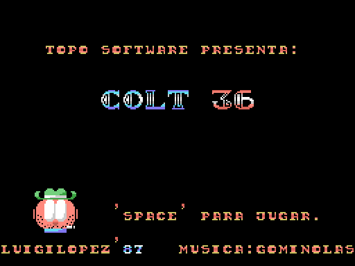
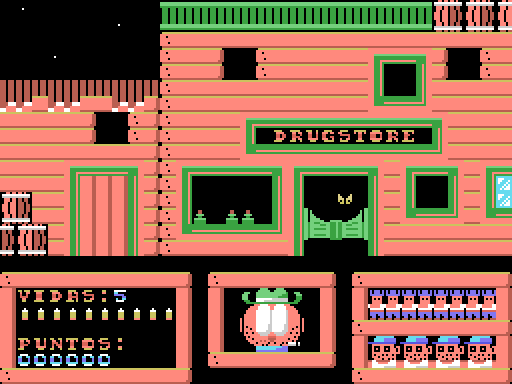
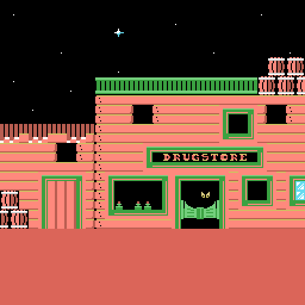

# Where to start

This is the commented disassembly of *Colt 36* (Topo Soft, MSX, 1987), a
four-level shooting gallery —EL ALMACÉN (the warehouse), EL CAÑÓN (the canyon),
LA MINA (the mine) and EL SALOON (the saloon)— released on cassette tape. It
explains, byte by byte, what is recorded on it.

One thing is worth knowing from the outset, because it shapes everything else:
**Colt 36 is not written in assembly**. The game is a 63-line MSX-BASIC program,
tokenised (the interpreter does not store the program text, but a compressed form
in which each keyword takes up one byte). Of Z80 code there are 309 bytes —two
routines that copy blocks —one to video memory, the other RAM to RAM— and a music player— plus the 45 that get the
interpreter going.

## What is here

`src/` holds the published listings; `tools/` the tools that extract the tape,
disassemble, draw and verify; `tests/` the tests that check the documentation
against the binary; `docs/` this documentation and its images. The `Makefile` is
the entry point. `extracted/`, `work/`, `dump/` and `build/` are generated by
`make` and are not versioned.

## The tape is not here

The tape image is **not distributed**: you have to supply your own, named
`colt36.tsx` and placed in the root of the project. TSX is a cassette image
format: it stores the blocks exactly as they are read from the audio. The copy
this work was done with is 34 722 bytes and this sha256:

    4f3090407ff22826a0ce1281908c497396cda972fe10dd0af694330cd62ebe13

If it is missing, `make` stops and says so; if the sha256 does not match, it warns
and carries on, because the listings might not correspond. Inside there are
34 239 bytes of content in five blocks.

Without it you can still do a fair amount. The listings in `src/` are in the
repository and can simply be read. And of the 65 tests, **26 pass on a fresh
clone**: the ones that check the game listing against what the documentation
says —that nobody jumps to line 730, or that the published addresses of the
machine-code routines are the ones the game declares with `DEFUSR`—. The other
39 skip themselves and state why.

## What `make` does

`make` extracts the blocks, regenerates the listings that come out of the tools,
runs the budget check, runs the tests and finishes with three reproducibility
checks. It needs Python 3 and `pasmo`, a command-line Z80 assembler.

The **budget** accounts for every byte of the tape against what the documentation
says it is: today, 34 239 explained out of 34 239. It is kept separate because it
catches a failure that reproducibility cannot see: if the tracer took graphics for
code, the bytes would still be the same and the binary would come out identical,
but the listing would be lying.

The **three reproducibility checks** decide whether any of this is worth
anything. First: `src/colt36.bas`, retokenised, has to give the 3935 bytes of the
original program. Second: the four assembly listings have to give their exact
binaries —`colt36_arranque.asm` 342 bytes, `colt36_topo.asm` 4254,
`colt36_scr.asm` 7100 and `colt36_cm2.asm` 18 352—. Third: the two halves of the
game block, concatenated, their 4277 bytes.

As long as that stays green, any claim in the documentation can be checked
against the binary, and any change in behaviour after touching the game can be
put down to what was touched and not to a misreading. Without that check, all of
this would be an opinion about a pile of bytes.

On their own: `make extract`, `make test`, `make clean` and `make ram`, which
starts openMSX with the real tape and dumps its RAM as the game begins, to
compare it with the memory image the project reconstructs.

## Retokenising instead of reassembling, and the role of `#`

In a normal disassembly the proof is reassembling. Here, since the game is BASIC,
the equivalent is **tokenising it again**. And that raises a problem: a BASIC
program cannot take explanations without changing the bytes, because a `REM`
takes up room in memory. Two files would be needed —one commented for reading and
one faithful for checking— and the commented one would end up out of date. This
is avoided by reserving the character `#` at the start of a line for the
project's comments: it is not MSX-BASIC syntax, the tokeniser ignores it, and so
**the published file is exactly the one that gets checked**. Of the 460 lines of
`src/colt36.bas`, 357 are our comments; 40 are blank and the remaining 63 are the game's program, as it is.

## The files in `src/`

- **`colt36.bas`** — the game: the complete MSX-BASIC program, line by line, with
  the explanations interleaved. The main document of the repository.
- **`colt36_arranque.asm`** — what sits behind the program in the same block: 297
  bytes of variable area and the 45 of Z80 code that copy the game to 0x8000,
  patch its first line and get the interpreter going.
- **`colt36_cm2.asm`** — the storehouse: drawings, backdrops, music and the
  support routines that the BASIC calls with `USR`.
- **`colt36_topo.asm`** — the publisher's animated logo, the first thing you see
  on loading. Byte for byte the same block that other Topo Soft tapes carry.
- **`colt36_scr.asm`** — the illustration shown while it loads.
- **`*.entries`, `*.notes`, `*.nocode`** — the input to the tools: known entry
  points, comments that get injected when the listings are generated, and the
  data ranges the tracer must not walk into.

## The tools you will want to use

**`tools/basic_detok.py`** does and undoes MSX-BASIC tokenisation: `detok` pulls
the text out of a binary, `tok` turns it back, `check` and `verify` test the round
trip. The internal pointers of a BASIC program are absolute, so it has to be given
the load address; here, 0x8000.

**`tools/render_niveles.py`** reconstructs what the game shows from the tape data,
following the lines of the program that paint each screen. These are not
screenshots: it is a check. If the block were carved up wrongly —if what we call
drawings were the colours— it would come out as noise. That the title and the
four backdrops come out legible is the strongest proof that the tables are where
we say they are.

    python3 tools/render_niveles.py work/CM2.raw docs/imagenes

**`tools/omsx_juega.tcl`** loads the tape in openMSX, leaves the game running and
takes screenshots. Loading it takes a while —blocks at normal speed, no fast
loading— so as soon as the game starts it saves a state, `colt36_arranque`, which
you get back to in a second with `openmsx -savestate colt36_arranque`. The tape
and the output are given to it in `COLT36_TSX` and `COLT36_OUT`.
