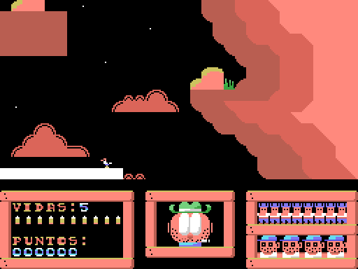
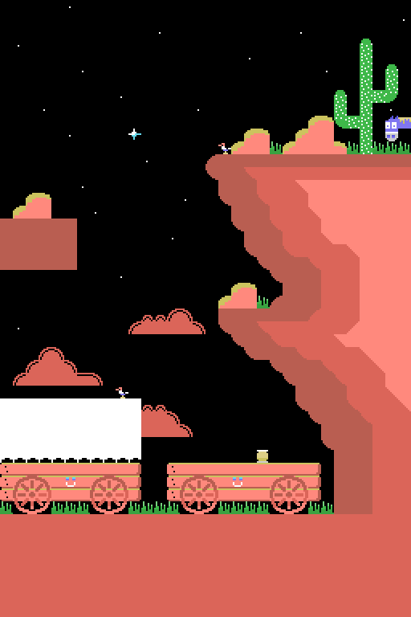
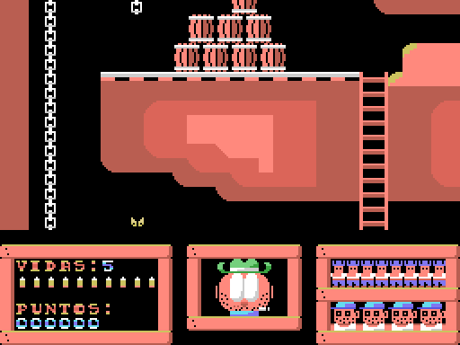
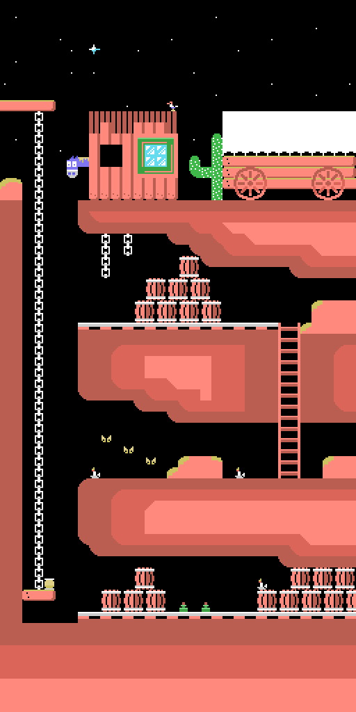
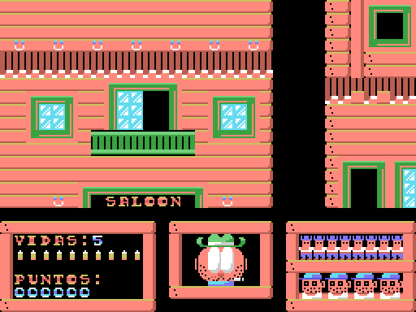
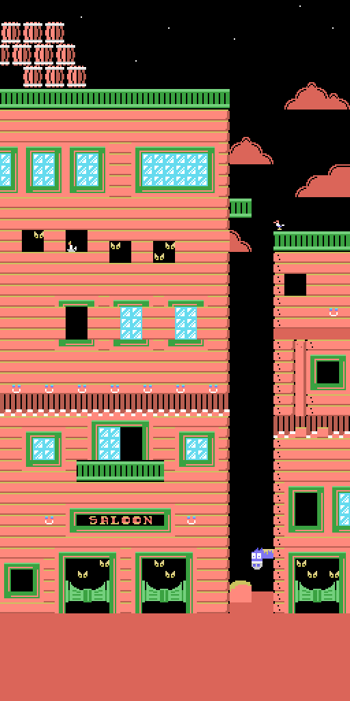

# The game

COLT 36 is a shooting gallery set in the Wild West. Four stages — **EL ALMACÉN** (the warehouse), **EL CAÑÓN** (the canyon), **LA MINA** (the mine) and **EL SALOON** (the saloon) — three lives, forty bullets per level and sixteen bandits to gun down in each one before moving on. At the end, depending on how far you got, the game grades you: CHAPUCERO (bungler), REGULARCILLO (so-so), BUENO (good), MUY BUENO (very good) or SHERIFF!!

The title screen is not just an idle picture. What the joystick moves is a fly buzzing around the cowboy in the artwork, and the cowboy's eyes track it with damped movement: the fly travels 44 pixels across and the eyes only five, so they follow it without popping out. Press fire and the game starts. The program reads keyboard and joystick at once (`STICK(0) OR STICK(1)`, `STRIG(0) OR STRIG(1)`), so either one works.

## The mechanics are not what they look like

Three things are worth understanding before looking at anything else, because none of the three is what you would assume from playing.

**The crosshair does not move up or down.** It is pinned to row 7 of the screen: its sprite — a 16×16 pixel pattern that the video chip draws on top of the background, here two layers overlaid to give it an outline — always sits at y=52. Up and down move the **scenery**. Left and right do move the crosshair, eight pixels at a time.

**The scroll is not a scroll.** The game treats the screen as a board of 32 columns by 24 rows and works on a copy of that board in memory, starting at 0xDA00. The top sixteen rows are the play area and the bottom eight the scoreboard, which does not move. Moving the scenery one row means adding or subtracting 32 from a pointer; and then, on every pass through the loop, **the whole 512-byte window is dumped again** to the screen from that new address. There is no pixel scrolling anywhere: there is one full dump per frame.

**The bandits are not sprites.** They are 2×2 tile blocks that the program POKEs onto the board in memory. The only sprites in the game are the crosshair, the muzzle flash, the title-screen fly and the eyes.

## Shooting

All of the game's hit detection is **a single PEEK**:

    PI%=PEEK(HL+225+X%\8)

`HL` is the tile where the visible area begins; the 225 is seven rows down (7×32) plus one column to the right, which is where the centre of the crosshair falls. The tile number found there is read and the decision made from it. Since the crosshair starts at X%=132 and moves eight at a time, it is always 4 modulo 8, so columns 1 to 31 can be aimed at: column 0 is never reachable.

If the number is 70 or below, there is nothing worth hitting. Tiles **71 to 78** are breakable objects: they are worth 1 to 8 points and are replaced by the tile eight numbers further on, which is their broken version — and since that version is already above 78, the same object cannot be cashed in twice. The damage lives in the memory copy, so it lasts until the level is reloaded: lose a life and everything is whole again. A warning for anyone studying the maps: tiles 79 to 86 never appear in the playable part of the four backdrops. The 386 tiles where they do occur — always 80 or 84 — are all in the rows of maps 1 and 2 that the scroll limit never lets you see.

From 174 upwards are the bandits. The filter has three conditions and each one plugs a different hole: the number has to reach 174, it must not be 255 — the empty tile, the commonest one in the scenery, without whose exception you would score twenty points shooting at thin air — and the bandit must not already be falling.

## The bandit cycle

Each bandit has a phase counter, PS%, which goes up by one per frame. Something only happens on the multiples of eight from 200 onwards:

| PS% | what happens |
|---|---|
| 208 | the warning sound plays **and** he pops out, in the same frame |
| 216, 224 | he animates |
| 232 | **he fires and takes a life off you** |
| 240 | he drops (only reached here if you hit him) |
| 248 | he is erased |
| 256 | his turn is over: another one is picked |

You have from PS%=209 to PS%=232 to hit him: **twenty-four frames**. The 232 counts because your shot is processed before his within the same pass, so hitting him on the very frame he is due to fire still saves you.

Each bandit model has five 2×2 frames, that is twenty tiles: model 1 takes tiles 174 to 193, model 2 194 to 213, model 3 214 to 233 and model 4 234 to 253. Three frames are for popping out, one for firing and the last for dropping.

Where they come from is a table at 0xD900: **ten hiding places per level, four bytes each** — row, column, model and appearance delay, the last one between 188 and 207, that is between 1 and 20 frames of waiting before popping out. One is picked at random, reseeding from the system clock, so a level's sixteen bandits come out of those ten spots and some repeat, sometimes twice in a row.

When they shoot at you there is one welcome touch: if the bandit was outside the visible window, the game pans row by row over to him to show you where the shot came from. And while you play, the eyes on the face presiding over the scoreboard look up, straight ahead or down depending on whether the bandit is above, inside or below what you are looking at: they are the clue to which way to search.

## The four backdrops

The four maps are stored as boards of 32 columns by 64 rows, 2048 bytes each, but **they are not used whole**. The scroll limit leaves level 1 at 32 rows and level 2 at 48; only 3 and 4 use all 64. The levels grow taller as you advance, and the last two are already the same size.

| | level | rows used | the map, as far as the scroll goes |
|---|---|---|---|
|  | 1 EL ALMACÉN | 32 |  |
|  | 2 EL CAÑÓN | 48 |  |
|  | 3 LA MINA | 64 |  |
|  | 4 EL SALOON | 64 |  |

## The scoreboard

Lives are written as a digit. The forty bullets are shown with ten tiles, four bullets per tile, and the sixteen bandits with eight columns in two rows, two per column. The screenshots read VIDAS:5 and six zeros of score because that is how the scoreboard is stored on the tape; as soon as the game starts the program writes the 3 of the three lives over it.

There are six zeros in the score, but the routine that writes it only puts four digits: the last two columns are left as decoration. Which means **the score is displayed multiplied by a hundred**. Gunning down a bandit adds 20 and the screen reads 2000.

The other bug shows up while playing: **bullets are not replenished when you lose a life**. The forty shots are per level. If you run out, shooting does nothing — not even a sound — you can no longer take anyone down, and whatever lives you have left go one after another with nothing you can do about it.

The final grade comes from where you got to: falling on level 1 is CHAPUCERO; on level 2, REGULARCILLO; on level 3, BUENO; on level 4, MUY BUENO. Finishing all four is SHERIFF!!
