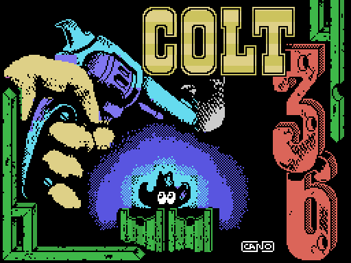

# Hallazgos

Colt 36 no está escrito en código máquina: el juego entero es un programa MSX-BASIC de 63 líneas, tokenizado y grabado en la cinta como si fuera un binario. De los 18 352 bytes del bloque de datos solo 309 son instrucciones del procesador. Eso tiene una ventaja para quien lo desmonta: los fallos se pueden señalar con el dedo, línea por línea. Lo que sigue es lo que salió al hacerlo, cada cosa con la prueba que la sostiene.

## La puntuación se enseña multiplicada por cien

Las ocho filas de abajo de la pantalla —el marcador— vienen dibujadas en la cinta y no se mueven durante la partida. En la fila 22, columnas 1 a 6, traen grabados **seis** ceros. La subrutina que refresca la puntuación, la línea 10, escribe solo **cuatro** cifras:

    10 Q=PT%/1000:VPOKE6849,Q+156: ... :VPOKE6852,Q+156:RETURN

`VPOKE` escribe un byte directamente en la memoria de vídeo, y cada byte de esa zona es el número de dibujo de una casilla. La dirección 6849 es la fila 22, columna 1, y las cuatro escrituras llegan hasta la columna 4. Las columnas 5 y 6 se quedan con el cero de fábrica para siempre. Abatir un bandido suma veinte puntos (`PT%=PT%+20`, línea 350) y en pantalla se lee 2000.


## Las balas no se reponen al perder una vida

La línea 599 es `M%=40:TI%=0`: cuarenta balas y el contador de bandidos a cero. El bucle de juego empieza en la 600. Cuando pierdes una vida, la línea 749 hace `VPOKE 6727,V%+156:GOSUB30:GOTO600`. Vuelve a la 600, no a la 599. Los cuarenta tiros son por nivel, no por vida.

Y esto no es cosmético, cambia cómo se juega de verdad. La rutina de disparo, la línea 300, empieza con `IF M%=0THENRETURN`: sin balas, apretar el botón no hace absolutamente nada, ni siquiera suena. Mientras tanto el bandido sigue su cuenta, y en el paso 232 de su contador de fase dispara y te quita una vida. Si te quedas sin munición con vidas de sobra, las ves caer una a una sin poder hacer nada.

## La línea 730 no la alcanza nadie

    730 PLAY"ACA":GOTO 610

Tres comprobaciones. El único reparto que podría llamarla, la línea 640, no la lista: `ON (PS%-200)\8 GOTO 690,700,700,740,700,720,760`. No hay ningún `GOTO`, `GOSUB` ni `THEN` en las 63 líneas que apunte al 730. Y la línea anterior acaba en `GOTO`, así que tampoco se cae en ella por orden. Es el resto de una versión anterior que se quedó dentro.

## Seis rarezas menores

- **Una errata en la línea 630**: `TR%=T`, por `TR%=T%`. No hace daño, porque la 635 reasigna `TR%` acto seguido y porque MSX-BASIC devuelve cero al leer una variable que no se ha usado antes. Pero la intención era otra.
- **Al terminar el juego se copia la fuente como si fuera un decorado.** La línea 2000 pone `N%=15` y llama a preparar nivel; allí la línea 33 hace `N%=N%+10*(N%>10)` y, como en MSX-BASIC una comparación cierta vale −1, `N%` queda en 5. La dirección sale de `&HA000+2048*(N%-1)`, o sea 0xC000, que no es el quinto nivel sino la tabla de dibujos: 2048 bytes de tipografía volcados sobre el tablero. No se nota porque se vuelve a la portada y el tablero se recarga antes de jugar.
- La línea 310 usa la forma de sprite número 8, y solo se cargan ocho formas, de la 0 a la 7. No se ve porque el sprite va a y=200, fuera de la pantalla.
- El tope izquierdo de la mira es `X%>0` y el paso son 8 píxeles partiendo de 132, así que los valores posibles bajan 132, 124… 12, 4, y desde 4 la condición todavía se cumple: `X%` acaba en −4: la mira se sale media casilla por el borde.
- **El marcador viene grabado con cinco vidas, y el juego empieza con tres.** En la fila 18, columna 7, el tablero del marcador trae el dibujo 161, que es el dígito grande **5**. La línea 597 escribe encima: `V%=3:VPOKE6727,156+V%`, y 6727 es exactamente esa casilla. Nadie llega a ver el cinco, pero está grabado en la cinta.
- **La cuarta ficha de nivel del marcador no se borra nunca.** La línea 2010, que hace `D%=6835+2*N%:VPOKED%,0`, solo llega a ejecutarse con `N%` valiendo 2, 3 y 4; con 5 la línea anterior ya ha saltado a la portada.

## Una línea numerada 65535

En la cinta, la primera línea del programa lleva el número **65535**, por encima del máximo que MSX-BASIC admite. Los 45 bytes de código máquina que acompañan al programa le escriben encima el número **4** justo antes de arrancar el intérprete. Sin ese parche el programa no corre: comprobado en el emulador saltando directamente a 0x9093, el `GOSUB 20` de la línea 520 aborta con *Undefined line number in 520*.

Y lo que contiene esa línea remata la idea: `POKE &HFBB1,1`. La dirección 0xFBB1 es BASROM, la posición con la que el sistema decide si CTRL+STOP puede interrumpir. Puesta a 1, el juego no se puede parar, y por tanto tampoco listar.

## Una variable que no es del juego

Entre el final del programa y el código de arranque hay 297 bytes que el intérprete pisa en los primeros milisegundos: ninguna línea del programa referencia una sola dirección de ese rango. Aun así, cuentan cómo se hizo la cinta.

En 0x8F60 hay once bytes con el formato exacto de una entrada de la tabla de variables del intérprete: `08` (doble precisión), la letra `I` con su relleno, y ocho bytes en BCD que valen **37025**. Reproducido byte a byte en el emulador. Y no es que *tengan la forma* de una entrada de la tabla de variables: el código de arranque hace `ld hl,08f60h / ld (0f6c2h),hl`, o sea que fija VARTAB —el puntero con el que el intérprete sabe dónde empieza su tabla de variables— exactamente en esa dirección. Colt 36 no puede haberla creado: usa `I%`, entera, y nunca una `I` doble. Es lo que había en la memoria de quien grabó la cinta.

Detrás vienen 285 bytes de RAM sin inicializar que siguen la regla «0xFF si el bit 0 de la dirección coincide con el bit 7, y 0x00 si no» —el contenido de encendido que openMSX documenta para varias máquinas— en 282 de los 285. Como la regla depende de la dirección **absoluta**, funciona como huella dactilar: encaja en 282 de los 285 (98,9 %) si el bloque estaba en 0x8000, y solo en 226 (79,3 %) si hubiera estado en 0x83E8, que es donde la cinta lo carga. En la máquina del programador el juego ya vivía en 0x8000; el 0x83E8 es un desvío para no pisar al cargador mientras carga, y lo primero que hace el arranque es copiarlo a su sitio.

## El BSAVE se hizo con el juego parado en la portada

Las dos rutinas de copia leen sus parámetros de un bloque fijo de seis bytes en 0xD9E1: cuánto, adónde y desde dónde. En la cinta vienen grabados con `00 03 / 00 18 / 00 D0`, o sea 768 bytes, destino 6144, origen 0xD000. Son exactamente los de la línea 572, `BC=768:DE=6144:HL=&HD000`, la que pinta el tablero de la portada.

Hay una segunda huella que apunta al mismo sitio: los 2048 bytes del área de trabajo (0xDA00–0xE1FF) traen una copia idéntica, byte a byte, del mapa del nivel 1 —comprobado comparando los dos rangos—, y esa área la rellena el programa al empezar cada nivel, así que no hace falta grabarla. El bloque no se ensambló en frío: se volcó desde un MSX que tenía el juego cargado y detenido en la pantalla de título.


## Cuarenta y ocho segundos de ahorro



La pantalla que se ve mientras carga el juego es solo una ilustración: no toca el chip de sonido, no espera y no comprueba nada. Lo interesante es cómo guarda el color. En este modo de pantalla el MSX admite un par de colores distinto en **cada una de las ocho líneas** de una celda de 8×8, lo que son 6144 bytes de atributos. Aquí se guarda uno solo por celda: 768 bytes, que la rutina replica ocho veces al vuelo. Cuesta que los degradados haya que resolverlos con tramado en damero, y ahorra 5376 bytes de cinta, que a esa velocidad son unos 48 segundos menos de espera. El pintado dura 0,27 s medidos en el emulador, con la pantalla apagada: la imagen aparece de golpe.

## La autoría, leída del binario

- La pantalla de presentación dice **LUIGILOPEZ 87** y **MUSICA:GOMINOLAS**.
- La pantalla de carga va firmada **CANO**, abajo a la derecha.
- El bloque del logo de la casa es byte a byte el mismo que aparece en otras cintas de Topo Soft: no se hizo para este juego.

Y hay un cuarto nombre que no llega nunca a la pantalla. El tablero de la portada viene grabado con el texto ya metido dentro, en forma de números de dibujo; descifrándolo (`dibujo − 60 = ASCII`, que es justo lo que hace al revés la rutina de escribir de la línea 15), la fila 22 dice:

```
LUIGILOPEZ.hg.PARA..............     h y g son los dibujos 164 y 163: los digitos grandes 8 y 7
```

**LUIGILOPEZ 87 PARA** — y ahí se corta la frase. La línea 575 escribe `  MUSICA:GOMINOLAS` a partir de la columna 14 de esa misma fila, que cae exactamente encima del `PARA`. Lo que se ve es `LUIGILOPEZ 87   MUSICA:GOMINOLAS`. El crédito se rehízo en algún momento y el resto del anterior sigue ahí, en el decorado, tapado con pintura cada vez que aparece la portada.
